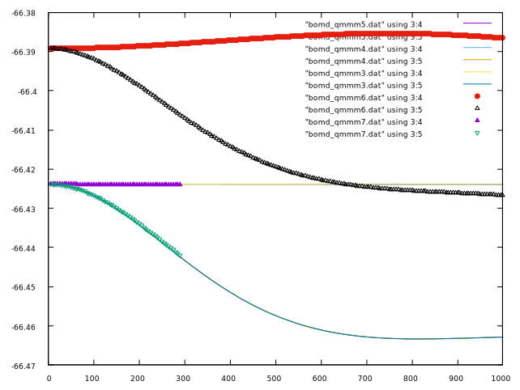

## CCl4-F QM/MM example
```
mpic++ bomd-qmmm3.cpp ../../build_library/libpwdft.so -o bomd_qmmm3.x
mpirun -np 4 ./bomd_qmmm3.x ccl4.nw  | tee bomd_qmmm3.out
fgrep @@ bomd_qmmm3.out00 | tee bomd_qmmm3.dat
```

## CCl4-F QM/MM example - read in MM atoms
```
 mpic++ bomd-qmmm4.cpp ../../build_library/libpwdft.so -o bomd_qmmm4.x
 mpirun -np 4 ./bomd_qmmm4.x ccl4-f.nw  | tee bomd_qmmm4.out
 fgrep @@ bomd_qmmm4.out00 | tee bomd_qmmm4.dat
```

## CCl4-F QM/MM example - read in MM atoms - qm/mm coulomb interactions removed and added back in
```
 mpic++ bomd-qmmm5.cpp ../../build_library/libpwdft.so -o bomd_qmmm5.x
 mpirun -np 4 ./bomd_qmmm5.x ccl4-f.nw  | tee bomd_qmmm5.out
 fgrep @@ bomd_qmmm5.out00 | tee bomd_qmmm5.dat
```

## CCl4-F QM/MM example - read in MM atoms - qm/mm and qm/qm coulomb interactions removed and added back in incorrectly like LJ pairs
```
 mpic++ bomd-qmmm6.cpp ../../build_library/libpwdft.so -o bomd_qmmm6.x
 mpirun -np 4 ./bomd_qmmm6.x ccl4-f.nw  | tee bomd_qmmm6.out
 fgrep @@ bomd_qmmm6.out00 | tee bomd_qmmm6.dat
```

## CCl4-F QM/MM example - read in MM atoms - qm/mm and qm/qm coulomb interactions removed and added back in correctly
```
 mpic++ bomd-qmmm7.cpp ../../build_library/libpwdft.so -o bomd_qmmm7.x
 mpirun -np 4 ./bomd_qmmm7.x ccl4-f.nw  | tee bomd_qmmm7.out
 fgrep @@ bomd_qmmm7.out00 | tee bomd_qmmm7.dat
```


## Plot energies
```
gnuplot

gnuplot> plot "bomd_qmmm5.dat" using 3:4 w l,"bomd_qmmm5.dat" using 3:5 w l,"bomd_qmmm4.dat" using 3:4 w l,"bomd_qmmm4.dat" using 3:5 w l,"bomd_qmmm3.dat"
using 3:4 w l,"bomd_qmmm3.dat" using 3:5 w l,"bomd_qmmm6.dat" using 3:4,"bomd_qmmm6.dat" using 3:5, "bomd_qmmm7.dat" using 3:4,"bomd_qmmm7.dat" using 3:5

```

<p align="center">
  
</p>
